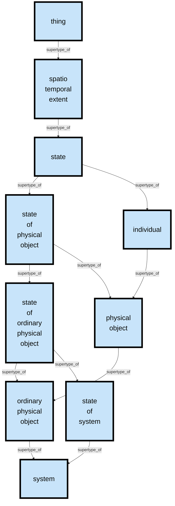
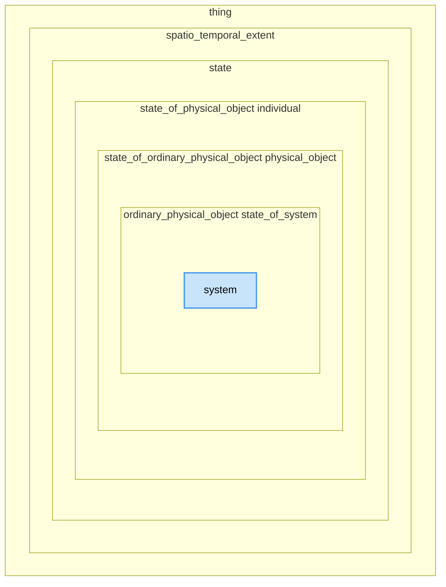

# HQDM Entity Type Spec command line tool

A command line tool to query the functional specification files of HQDM for the specification of a provided entity type id (or name), to output the entity type path to Thing and the specification of the entity type itself. Enity type names are all lower-case and as documented originally in HQDM and it's [wiki](https://github.com/hqdmTop/hqdmFramework/wiki/). Although this tool accepts entity type names the functional queries are all done using ids.  To render the type hierarchy ASCII diagrams in a more accessible way, the entity type names are given.  However, the Relation Specifications and CSV outputs all use entity and relation ids.  The relation set heirarchy can be queried with the [`relationPathUp`](https://github.com/ClimbingAl/hqdmHaskell/tree/main/relationPathUp) tool.

## Example

`entityTypeSpec -a PureHqdmRelations_v5.csv HqdmTypes_v4.csv spatio_temporal_extent`

or

`entityTypeSpec -a PureHqdmRelations_v5.csv HqdmTypes_v4.csv dd8359c4-0a2b-416a-af27-3bcb0551b41a`

Both entity name and entity type id are accepted as arguments for the HQDM Entity Type being queried.

## General Command pattern

entityTypeSpec -a <Relation_file.csv> <EntityType_file.csv> <uuid_or_name_of_entity_type>

It is recommended to use the Relation File and Entity Type Files provided in this folder unless you are confident you have a reason for not using them.

## Running the command
This runs on any Linux command line as:

`./entityTypeSpec -ac PureHqdmRelations_v5.csv HqdmTypes_v4.csv spatio_temporal_extent`

It may run on macOS (could be straightforward) and Windows (likely non-trivial), I haven't tried it.  The binary for this is included in the repo so that youy don't have to build it.  If you don't like trusting binaries then you can rebuild it by installing the Haskell GHC and Cabal build system. The command `stack build` will then build this command line tool and all of its dependencies.  The tool can then be used using `stack` itself like this:

`stack exec -- entityTypeSpec -a PureHqdmRelations_v9.csv HqdmTypes_v4.csv functional_system`

If you wish to use it without `stack` then you can build it with th `--copy-bins` switch. 

`stack build --copy-bins .`

This will copy the binary to the local bin path (you can then use it locally or copy it top where you need it) and as shown above. If you are using the Haskell dev container included in the vscode workspace [dev container file](https://github.com/ClimbingAl/hqdmHaskell/blob/main/.devcontainer/devcontainer.json) for this repo then the path to the built binary will be here: `/home/vscode/.local/bin/`.  You can move it to whereever you want it to be accessible.  If you do this, ensure that it has executable permissions (e.g. `-rwxr-xr-x`).

## Switches

`-a` ASCII output as a type hierarchy (supertype path followed by a subtype tree) and list of the relations for the specified HQDM Entity Type.

`-c` Provides a CSV representation of the Binary Relation Sets, with the columns ordered as per the arguments for PureBinaryRelation new data Type

`-g` GraphViz output - Not yet implemented

`-m` Mermaid output - Two forms of diagrams output, a subtype-supertype inheritance graph and an Euler diagram of type enclosure (viewable using https://mermaid.live/edit)

## Example output

Mermaid diagram showing the inheritance path from **system** up to **thing**:


Mermaid diagram showing an Euler representation of the types from **system** up to **thing**:


ASCII output of the entity type **spatio_temporal_extent**:
```
ASCII Entity Type Inheritance Supertype Path To Thing from 'spatio_temporal_extent' (dd8359c4-0a2b-416a-af27-3bcb0551b41a):


                                                                                                [thing] 
                                                                                                   ^
                                                                                                  /|\
                                                                                                   |
                                                                                        [spatio_temporal_extent] 
 

ASCII Entity Type Inheritance Subtype Path from 'spatio_temporal_extent' (dd8359c4-0a2b-416a-af27-3bcb0551b41a):


                                                                                        [spatio_temporal_extent] 
                                                                                                   ^
                                                                                                  /|\
                                                                                                   |
                                                                                     [event] [requirement] [state] 
                                                                                                   ^
                                                                                                  /|\
                                                                                                   |
[point_in_time] [beginning_of_ownership] [ending_of_ownership] [period_of_time] [state_of_activity] [state_of_association] [individual] [state_of_intentionally_constructed_object] [state_of_physical_object] 
                                                                                                   ^
                                                                                                  /|\
                                                                                                   |
[possible_world] [activity] [state_of_socially_constructed_activity] [association] [intentionally_constructed_object] [physical_object] [state_of_socially_constructed_object] [state_of_functional_object] [state_of_biological_object] [participant] [state_of_ordinary_physical_object] [state_of_system_component] [state_of_amount_of_money] 
                                                                                                   ^
                                                                                                  /|\
                                                                                                   |
[plan] [socially_constructed_activity] [ownership] [employment] [representation_by_sign] [functional_object] [socially_constructed_object] [ordinary_physical_object] [biological_object] [amount_of_money] [system_component] [state_of_sign] [state_of_organization] [state_of_socially_constructed_activity] [state_of_organization_component] [state_of_amount_of_money] [state_of_ordinary_functional_object] [state_of_functional_system_component] [state_of_biological_system_component] [state_of_ordinary_biological_object] [transferor] [transferee] [sign] [employer] [asset] [recognizing_language_community] [owner] [employee] [installed_object] [state_of_system] [money_asset] 
                                                                                                   ^
                                                                                                  /|\
                                                                                                   |
[reaching_agreement] [offer] [transfer_of_ownership] [agreement_execution] [agreement_process] [acceptance_of_offer] [functional_system_component] [ordinary_functional_object] [socially_constructed_activity] [sign] [amount_of_money] [organization_component] [organization] [ordinary_biological_object] [system] [biological_system_component] [state_of_language_community] [state_of_position] [money_asset] [state_of_sales_product_instance] [state_of_functional_system] [installed_functional_system_component] [in_place_biological_component] [state_of_biological_system] [person_in_position] [state_of_party] 
                                                                                                   ^
                                                                                                  /|\
                                                                                                   |
[agree_contract] [offer_for_goods] [transfer_of_ownership_of_money] [contract_execution] [contract_process] [acceptance_of_offer_for_goods] [functional_system] [sales_product_instance] [reaching_agreement] [offer] [transfer_of_ownership] [agreement_execution] [agreement_process] [acceptance_of_offer] [position] [language_community] [biological_system] [party] [recognizing_language_community] [person_in_position] [state_of_person] [transferor] [transferee] [state_of_organization] [employer] [owner] 
                                                                                                   ^
                                                                                                  /|\
                                                                                                   |
[offer_and_acceptance_for_goods] [exchange_of_goods_and_money] [sale_of_goods] [agree_contract] [offer_for_goods] [transfer_of_ownership_of_money] [contract_execution] [contract_process] [acceptance_of_offer_for_goods] [person] [organization] [person_in_position] [employee] [state_of_language_community] 
                                                                                                   ^
                                                                                                  /|\
                                                                                                   |
                                  [offer_and_acceptance_for_goods] [exchange_of_goods_and_money] [sale_of_goods] [language_community] [recognizing_language_community] 
 

HQDM Relations expressed as Binary Relation Sets:

1 RELATION SPECIFICATION:
        Domain: dd8359c4-0a2b-416a-af27-3bcb0551b41a
        Relation UUID: ac3fd9bd-a64d-4e87-8da6-1ce76451fde5
        Original Relation Name: part__of
        Range: dd8359c4-0a2b-416a-af27-3bcb0551b41a
        Min Cardinality: 0
        Max Cardinality: -1


2 RELATION SPECIFICATION:
        Domain: dd8359c4-0a2b-416a-af27-3bcb0551b41a
        Relation UUID: 96c965a9-ec3e-47f2-b18e-b67147bc0873
        Original Relation Name: beginning
        Range: 545b4541-8a34-46b8-8704-2265be0244c3
        Min Cardinality: 0
        Max Cardinality: -1


3 RELATION SPECIFICATION:
        Domain: dd8359c4-0a2b-416a-af27-3bcb0551b41a
        Relation UUID: aee002be-0529-4b80-82b0-0a6bcca34e48
        Original Relation Name: ending
        Range: 545b4541-8a34-46b8-8704-2265be0244c3
        Min Cardinality: 0
        Max Cardinality: -1


4 RELATION SPECIFICATION:
        Domain: dd8359c4-0a2b-416a-af27-3bcb0551b41a
        Relation UUID: d2bd9e45-948f-4570-91c2-b0693cd81363
        Original Relation Name: part_of_possible_world
        Range: a5dc8c36-56fc-44c2-909b-7592b1f44fd7
        Min Cardinality: 1
        Max Cardinality: -1


5 RELATION SPECIFICATION:
        Domain: dd8359c4-0a2b-416a-af27-3bcb0551b41a
        Relation UUID: e052b90c-13c3-4fea-8289-0c995656ed8f
        Original Relation Name: member_of
        Range: bb6f6d3f-1ed1-41ab-942c-6b3667c5da37
        Min Cardinality: 0
        Max Cardinality: -1


6 RELATION SPECIFICATION:
        Domain: dd8359c4-0a2b-416a-af27-3bcb0551b41a
        Relation UUID: 2fe747d1-a196-41a2-baf5-7b603aed9c57
        Original Relation Name: temporal__part_of
        Range: dd8359c4-0a2b-416a-af27-3bcb0551b41a
        Min Cardinality: 0
        Max Cardinality: -1


7 RELATION SPECIFICATION:
        Domain: dd8359c4-0a2b-416a-af27-3bcb0551b41a
        Relation UUID: 45718dab-3b33-4d47-ba46-ddaeef3cdf4c
        Original Relation Name: aggregated_into
        Range: dd8359c4-0a2b-416a-af27-3bcb0551b41a
        Min Cardinality: 0
        Max Cardinality: -1


8 RELATION SPECIFICATION:
        Domain: dd8359c4-0a2b-416a-af27-3bcb0551b41a
        Relation UUID: fa7b1f1a-1e9f-42b9-8513-ddb7a2e74c90
        Original Relation Name: consists__of
        Range: dd8359c4-0a2b-416a-af27-3bcb0551b41a
        Min Cardinality: 0
        Max Cardinality: 1


9 RELATION SPECIFICATION:
        Domain: dd8359c4-0a2b-416a-af27-3bcb0551b41a
        Relation UUID: 8130458f-ae96-4ab3-89b9-21f06a2aac78
        Original Relation Name: element_of_type
        Range: dd8359c4-0a2b-416a-af27-3bcb0551b41a
        Min Cardinality: 0
        Max Cardinality: -1


10 RELATION SPECIFICATION:
        Domain: dd8359c4-0a2b-416a-af27-3bcb0551b41a
        Relation UUID: 8e8afaba-7053-452b-93e5-39009a69a641
        Original Relation Name: member__of
        Range: 4a8cba08-035c-4902-935b-26da61ed282c
        Min Cardinality: 0
        Max Cardinality: -1


Read about it here: https://github.com/hqdmTop/hqdmFramework/wiki/spatio_temporal_extent

```
